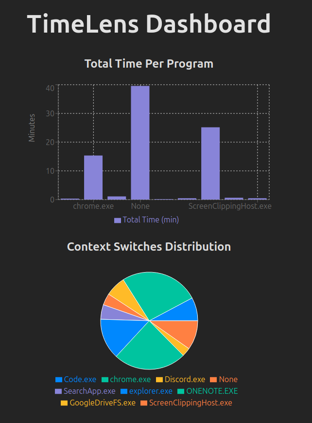

# TimeLens

TimeLens is a standalone Windows application for tracking and analyzing your computer usage patterns with a focus on productivity and personal insights. All data is stored locally, ensuring complete privacy while providing meaningful metrics about your computer habits.



## Features

### Activity Tracking
- **Window Focus Tracking**: Monitors active windows and applications in real-time
- **Program Usage Statistics**: Tracks time spent on different applications
- **Context Switch Analysis**: Measures how often you switch between different tasks
- **Private & Secure**: All data stored locally on your machine

### Data Visualization
- Interactive dashboard built with React and Recharts
- Visual insights including:
  - Total time per program
  - Context switch distribution
  - Daily activity timeline
  - Program usage patterns

### Todo Management
- Built-in todo list functionality
- Add and manage tasks through CLI interface
- Track task creation dates and times

## Tech Stack

- **Backend**: Python, FastAPI
- **Frontend**: React, Vite, TailwindCSS
- **Data Visualization**: Recharts
- **Database**: SQLite
- **Windows API Integration**: win32gui, psutil

## Installation

1. Clone the repository:
```bash
git clone https://github.com/kevindsouza03/timelens.git
cd timelens
```

2. Set up Python virtual environment:
```bash
python -m venv env
.\env\Scripts\activate  # Windows
source env/bin/activate  # Unix/MacOS
```

3. Install Python dependencies:
```bash
pip install fastapi uvicorn pandas win32gui psutil inquirer
```

4. Install frontend dependencies:
```bash
cd TimeLens
npm install
```

## Usage

### Start the Backend Server

1. Activate virtual environment:
```bash
.\env\Scripts\activate  # Windows
source env/bin/activate  # Unix/MacOS
```

2. Run the API server:
```bash
python api.py
```

### Start the Frontend

1. In a new terminal, navigate to the TimeLens directory:
```bash
cd TimeLens
```

2. Start the development server:
```bash
npm run dev
```

3. Open `http://localhost:5173` in your browser

### Track Activity

Run the main script to start tracking:
```bash
python main.py
```

Select from the following options:
- **Track Usage**: Begin monitoring window focus
- **Work Session**: Start a focused work session
- **Add Todo**: Add items to your todo list
- **Visualize**: Launch the visualization dashboard

Press `Ctrl+C` to stop tracking. Data will be automatically processed and stored.

## Database Structure

TimeLens uses SQLite with the following tables:

- `focus_logs`: Raw activity data
- `program_insights`: Per-program analytics
- `daily_insights`: Daily usage patterns
- `general_insights`: Overall usage statistics

## Development

### Project Structure
```
timelens/
├── api.py            # FastAPI backend server
├── focus.py          # Core tracking functionality
├── main.py           # CLI interface
├── editTodo.py       # Todo management
├── TimeLens/         # Frontend React application
└── results/          # Data storage directory
```

### Contributing

1. Fork the repository
2. Create a feature branch
3. Commit your changes
4. Push to the branch
5. Open a Pull Request

## Privacy

TimeLens is designed with privacy in mind:
- All data is stored locally in SQLite database
- No external services or APIs are used
- Complete control over your usage data
- Open source for transparency


## Acknowledgments

Built with:
- [React](https://reactjs.org/)
- [Recharts](https://recharts.org/)
- [FastAPI](https://fastapi.tiangolo.com/)
- [TailwindCSS](https://tailwindcss.com/)